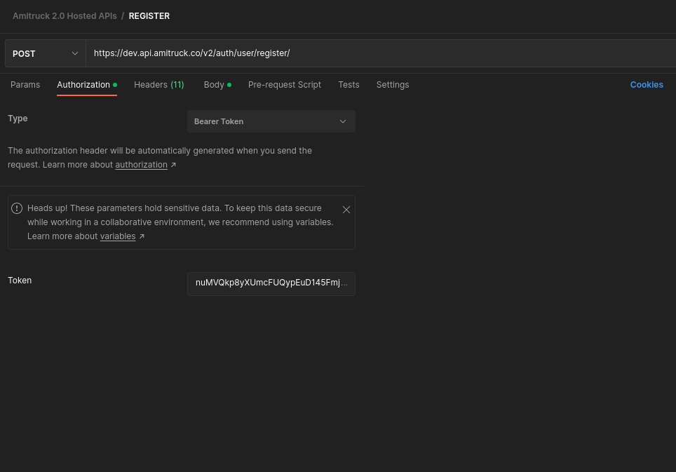
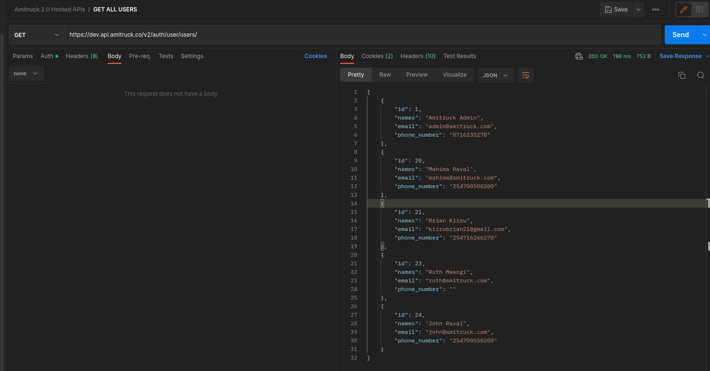

# Amitruck 2.0 - Authentication and Authorization API Documentation

<div align="center">
	<br>
	<br>
	
	<br>
	<br>

📝 This is the official Amitruck 2.0 Authentication and Authorization APIs Documentation

## Badges will go here

<!-- [](https://github.com/rigwild/apidoc-markdown/actions)
[](https://www.npmjs.com/package/apidoc-markdown)
[](https://www.npmjs.com/package/apidoc-markdown)
[](./LICENSE) -->

</div>

<br><br>

# Introduction

Welcome to Amitruck 2.0 Authentication and Authorization Service. This service requires users to register their applications first before they can be able to use our service.

Applications are registered using django o-auth service which provides a user interface where a user must enter their application name. Applications in this case could be mobile or web applications. Django o-auth service automatically provides Client id and Client secret after the application name field. At this point, the user should take note of this two very important fields by copying them in a separate file. This fields will be used to generate a token that will allow the user to access all other APIs. Next, the user will be required to select the client type.
The client type should be confidential in this case. This is because we want to ensure the security of the application.

<br><br>

# Step One

Next the user is required to select the Authorization grant type which is this case is Resource owner passsword-based. Here we are maing use of password as the grant type when generating the token.

Next the user will fill in the Redirect uris e.g https://dev.api.amitruck.co/v2/auth/user/redirect/. Redirect URIs are used by our OAuth authentication service as a security measure. ORCID will only send authenticating users to URIs registered by the client requesting authentication. This prevents services from impersonating each other. See the screenshot below. Before saving the application, please note down the CLIENT_ID AND CLIENT SECRET in a separate file.` Please make sure this two variables are only known to you`. Congrats you have made your first application.

<div align="center">
	<br>
	<br>
	
	<br>
	<br>

</div>

<br><br>

# Step Two

You will now start your Postman on your local machine. In this case a postman Collection will have been shared with you. We shall start by generating a token inorder to be able to use other APIs. Head to the GET TOKEN request on postman. The url should be ` https://dev.api.amitruck.co/v2/auth/user/o-auth/token/`

The body of this should be as shown below. The body contains superuser credentials as shown in the example blow:

<div align="center">
	<br>
	<br>
	
	<br>
	<br>

</div>

The next step is very important inorder for us to get the access_token. For you to get the token, thr client_id and client token we got from step one are required. As seen in the screenshot below, we use the client_id as the username and client secret as the password in the Auth section using Basic Auth type.

<div align="center">
	<br>
	<br>
	
	<br>
	<br>

</div>

Once this is done, go ahead and make the request by pressing the send button. If all parameters you passsed are correct you should get a response as shown below with ` access_token`, ` expires_in`, ` token_type`, ` scope` and ` refresh_token`.

```ts
{
    "access_token": "DfpgIlRgMKenGagBCbOZl1JC7kMeVh",
    "expires_in": 36000,
    "token_type": "Bearer",
    "scope": "read write groups",
    "refresh_token": "v26jHOfmd1hXV97iLoyAVJrZgXWdtZ"
}
```

<br><br>

# Accessing other APIs

Congratulations on reaching this step. Now that we have the token, we can use it to be able to access other API endpoints. We shall start by looking at the user register endpoint. On Post man navigate to the Register request with url `https://dev.api.amitruck.co/v2/auth/user/register/`.
We are going to provide the following payload in the body part in JSON format.

```ts
{
	"email": "test@amitruck.com",
    "phone_number": "254700500200",
    "names": "Amitrurk User",
    "password": "Test1234",
    "password_confirm": "Test1234"

}
```

We Shall then go to the Authorization part of thid request and pass our `access_token` which we got from step 2 above.

<div align="center">
	<br>
	<br>
	
	<br>
	<br>

</div>

After that we shall send the request by clicking the send button. If all parameters are correct we expect to get the following response.
<br><br>

```ts
{
    "status": "Success",
    "code": 201,
    "message": "Registration Successful",
    "data": [
        {
            "id": 3,
            "names": "Amitrurk User",
            "email": "test@amitruck.com",
            "phone_number": "254700500200"
        }
    ],
    "token": "7f82a49e98030b4476858786a3f3ebac274b6ca4a87691e21696dfe15b6a1431"
}
```

<br><br>
Now that we have successfully created a user, we can go ahead and log them onto Amitruck 2.0.

Head to postman and find the Login request. Here we reuqire the email and password of the registered user we created. We shall pass the below payload, not forgetting to pass our `access_token` in the authorization tab as we did during register.

```ts
{
    "email":"test@amitruck.com",
    "password":"Test1234"
}
```

We shall then send the request and if the email and password are correct and belong to an existing user, we shall get the following resposne.

```ts
{
    "status": "Success",
    "code": 200,
    "message": "You have been logged in Successfully",
    "token": "e0d16caff7f4aa96f2173655f769b7704274ee1069d2be444ccbf691f5173958"
}
```

<br><br>

Now we can go ahead and query for users in our database to see if we shall be able to get the user we just created and logged in. To do this we shall go ahead and to our postman to the `GET ALL USERS` request and send the Get request. We should be bale to query a list of users and see the user we just created. See the screeshot below:

<div align="center">
	<br>
	<br>
	
	<br>
	<br>

</div>
