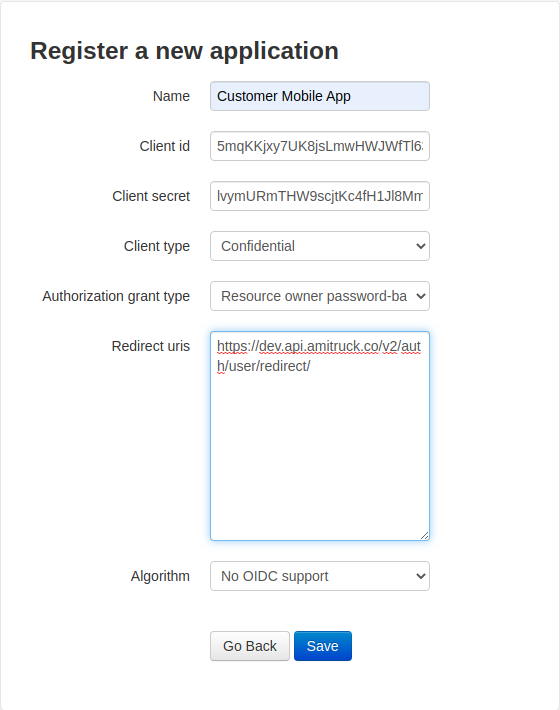
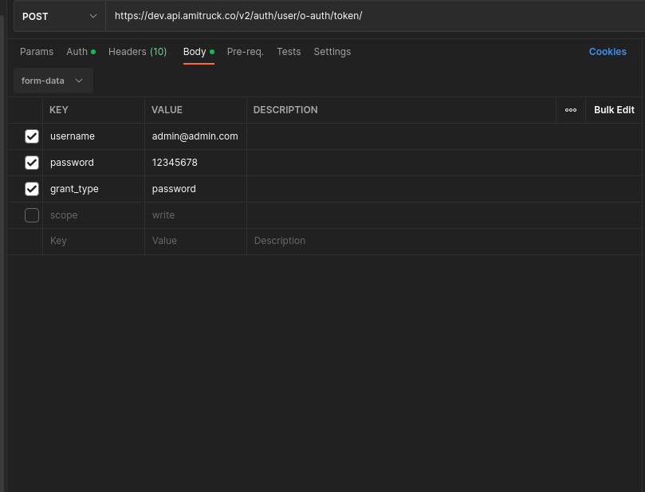

# Amitruck 2.0 - Authentication and Authorization API Documentation

<div align="center">
	<br>
	<br>
	
	<br>
	<br>

📝 This is the official Amitruck 2.0 Authentication and Authorization APIs Documentation

## Badges will go here

<!-- [](https://github.com/rigwild/apidoc-markdown/actions)
[](https://www.npmjs.com/package/apidoc-markdown)
[](https://www.npmjs.com/package/apidoc-markdown)
[](./LICENSE) -->

</div>

# Introduction

Welcome to Amitruck 2.0 Authentication and Authorization Service. This service requires users to register their applications first before they can be able to use our service.

Applications are registered using django o-auth service which provides a user interface where a user must enter their application name. Applications in this case could be mobile or web applications. Django o-auth service automatically provides Client id and Client secret after the application name field. At this point, the user should take note of this two very important fields by copying them in a separate file. This fields will be used to generate a token that will allow the user to access all other APIs. Next, the user will be required to select the client type.
The client type should be confidential in this case. This is because we want to ensure the security of the application.

# Step 0ne

Next the user is required to select the Authorization grant type which is this case is Resource owner passsword-based. Here we are maing use of password as the grant type when generating the token.

Next the user will fill in the Redirect uris e.g https://dev.api.amitruck.co/v2/auth/user/redirect/. Redirect URIs are used by our OAuth authentication service as a security measure. ORCID will only send authenticating users to URIs registered by the client requesting authentication. This prevents services from impersonating each other. See the screenshot below. Before saving the application, please note down the CLIENT_ID AND CLIENT SECRET in a separate file.` Please make sure this two variables are only known to you`. Congrats you have made your first application.

<div align="center">
	<br>
	<br>
	
	<br>
	<br>

</div>

# Step Two

You will now start your Postman on your local machine. In this case a postman Collection will have been shared with you. We shall start by generating a token inorder to be able to use other APIs. Head to the GET TOKEN request on postman. The url should be ` https://dev.api.amitruck.co/v2/auth/user/o-auth/token/`

The body of this should be as shown below. The body contains superuser credentials as shown in the example blow:

<div align="center">
	<br>
	<br>
	
	<br>
	<br>

</div>

The next step is very important inorder for us to get the access_token. For you to get the token, thr client_id and client token we got from step one are required.

```ts
{
    "access_token": "DfpgIlRgMKenGagBCbOZl1JC7kMeVh",
    "expires_in": 36000,
    "token_type": "Bearer",
    "scope": "read write groups",
    "refresh_token": "v26jHOfmd1hXV97iLoyAVJrZgXWdtZ"
}
```

## How does it look? Give me some examples!

Some examples are available in the [`example`](./example) directory.

Take a look at [`example/strider/api.md`](./example/strider/api.md) which shows a real-world example taken from the [Strider](https://github.com/Strider-CD/strider) API.

## Install

```bash
# For the global CLI
pnpm install --global apidoc-markdown

# For programmatic usage or local project CLI install
pnpm install apidoc-markdown
```

Then, generate your documentation using your newly added command `apidoc-markdown` or [programmatically](#programmatic-usage-API).

**Note**: Node.js v14+ minimum is required. `apidoc-markdown` uses [`apidoc-light`](https://github.com/rigwild/apidoc-light) internally.

## CLI usage

```
Generate a Simple and Portable Markdown documentation for your API.
Usage: apidoc-markdown -i <path> -o <output_file> [-t <template_name>] [--multi] [--createPath] [--prepend <file_path>]

Options:
      --version     Show version number                                                                                            [boolean]
  -i, --input       Input source files path                                                             [string] [required] [default: "src"]
  -o, --output      Output file or directory to write output to.                                                         [string] [required]
  -t, --template    Name of the template to be used (`default`, `bitbucket`) or path to an EJS template file.  [string] [default: "default"]
      --header      Path to file content to add at the top of the documentation.                                                    [string]
      --footer      Path to file content to add at the bottom of the documentation.                                                 [string]
      --prepend     Path to file content to add before route groups documentation.                                                  [string]
      --multi       Output one file per group to the `output` directory.                                          [boolean] [default: false]
      --createPath  Recursively create directory arborescence to the `output` directory.                          [boolean] [default: false]
  -h, --help        Show help                                                                                                      [boolean]

Examples:
  apidoc-markdown -i src -o doc.md                           Generate from `src` source files to `doc.md`
  apidoc-markdown --input src --output doc.md                Generate from `src` source files to `doc.md`
  apidoc-markdown -i src -o doc.md -t bitbucket              Generate from `src` source files to `doc.md` using the `bitbucket` template
  apidoc-markdown -i src -o doc.md -t my_custom_template.md  Generate from `src` source files to `doc.md` using a provided template file
  apidoc-markdown -i src -o doc --multi                      Generate from `src` source files to `doc/<group>.md`

apidoc-markdown - https://github.com/rigwild/apidoc-markdown
```

### Examples

Generate documentation (See [`./example/basic/example.md`](./example/basic/example.md)).

```
apidoc-markdown -i src -o doc.md
```

You can select a provided template by using `-t` or `--template` (`default`, `bitbucket`).

```
apidoc-markdown -i src -o doc.md -t bitbucket
```

You can pass the path to your own template by using `-t` or `--template`.

```
apidoc-markdown -i src -o doc.md -t my_custom_template.md
```

You can inject a header, footer or prepend section in your documentation with the content of a file using `--header`, `--footer` and `--prepend`.

```
apidoc-markdown -i src -o doc.md --header header.md
apidoc-markdown -i src -o doc.md --footer footer.md
apidoc-markdown -i src -o doc.md --prepend prepend.md

apidoc-markdown -i src -o doc.md --header header.md --footer footer.md --prepend prepend.md
```

Generate documentation with one file per group (See [`./example/multi`](./example/multi)).

```
apidoc-markdown -i src -o doc --multi
```

### Quick and easy project integration

Install `apidoc-markdown` as a dev dependency.

```bash
pnpm install -D apidoc-markdown
```

Add the following script to your `package.json` file (`src` is where are stored your source files containing some [apiDoc](https://apidocjs.com/) annotations).

```json
{
	"scripts": {
		"doc": "apidoc-markdown -i src -o DOCUMENTATION.md"
	}
}
```

Run the npm script to generate the `DOCUMENTATION.md` file.

```bash
pnpm doc
```

## Programmatic usage API

#### generateMarkdownFileSystem

Generate mardown documentation using the file system and creating output file(s).

```ts
import path from "path";
import { generateMarkdownFileSystem } from "apidoc-markdown";

const documentation: Doc = await generateMarkdownFileSystem({
	/** Input source files path */
	input: path.resolve(__dirname, "path", "to", "your", "sources", "directory"),

	/** Output file or directory to write output to */
	output: path.resolve(__dirname, "doc.md"),

	/** Optional: Name of template to be used (`default`, `bitbucket`)
	 * or path to EJS template file
	 * or raw EJS plain text template
	 * (will use default template if ommitted). */
	template: "default",

	/** Optional: Path to file content to add at the top of the documentation */
	header: path.resolve(__dirname, "add-this-to-the-top"),

	/** Optional: Path to file content to add at the bottom of the documentation */
	footer: path.resolve(__dirname, "add-this-to-the-bottom"),

	/** Optional: Path to file content to add before route groups documentation */
	prepend: path.resolve(__dirname, "prepend-this-to-api-routes"),

	/** Optional: Output one file per group to the `output` directory */
	multi: false,

	/** Optional: Recursively create directory arborescence to the `output` directory */
	createPath: true,
});

// Output
type Doc = Array<{
	name: string; // Api group name
	content: string; // Documentation content
}>;

// (if `multi` is `false`, you get an array with 1 element!)
```

#### generateMarkdown

Generate mardown documentation by passing directly the apiDoc output.

```ts
import { generateMarkdown } from "apidoc-markdown";

const documentation: Doc = await generateMarkdown({
	/** apiDoc project JSON data object `apidoc.json` file content) */
	apiDocProjectData: { name: "test", version: "0.13.0" /* ... */ },

	/** apiDoc documentation JSON data object (`api_data.json` file content) */
	apiDocApiData: [{ type: "get", url: "/define" /* ... */ }],

	/** Optional: Name of template to be used (`default`, `bitbucket`)
	 * or path to EJS template file
	 * or raw EJS plain text template
	 * (will use default template if ommitted). */
	template: "my EJS template <%= project.name %> v<%= project.version %>",

	/** Optional: Content to add at the top of the documentation */
	header: "Add this text at the top of the doc!",

	/** Optional: Content to add at the bottom of the documentation */
	footer: "Add this text at the bottom of the doc!",

	/** Optional: Content to add before route groups documentation */
	prepend: "Prepend this before the API routes documentation!",

	/** Optional: Generate one documentation output per group */
	multi: false,
});

// Output
type Doc = Array<{
	name: string; // Api group name
	content: string; // Documentation content
}>;

// (if `multi` is `false`, you get an array with 1 element!)
```

## Configuration

### Using `apidoc.json`

The `header`, `footer` and `prepend` options can be configured directly in your `apidoc.json` (see [`apidoc.json` documentation](https://apidocjs.com/#configuration)).

Add it like this:

```json
{
	"name": "test",
	"version": "0.1.2",
	"description": "test",
	"title": "test",
	"url": "https://test.example.com/",
	"header": {
		"filename": "header.md"
	},
	"footer": {
		"filename": "footer.md"
	},
	"prepend": {
		"filename": "prepend.md"
	}
}
```

**Note:** This only works if you use the CLI or [`generateMarkdownFileSystem`](#generateMarkdownFileSystem).

### API groups order

You can choose the order in which the documentation groups gets generated by adding an `order` key in `apidoc.json`. [See example `apidoc.json`](./test/_testFiles/input/apidoc.json#L15-L22) and [generated example output](./example/basic/example.md).

**Note:** This is only useful when generating the documentation to a single output file (`multi` is `false`).

## Contribute

Share your custom templates in [this discussion!](https://github.com/rigwild/apidoc-markdown/discussions/24)

Suggest any feature you would like by creating an [issue](https://github.com/rigwild/apidoc-markdown/issues) or a [pull request](https://github.com/rigwild/apidoc-markdown/pulls).

When reporting bugs, please fill the issue template correctly with as much info as possible to help me debug and understand what's happening.

⭐ Star the project to help it grow! 😄

## License

[The MIT license](./LICENSE)
